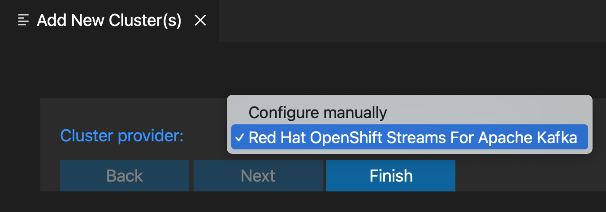
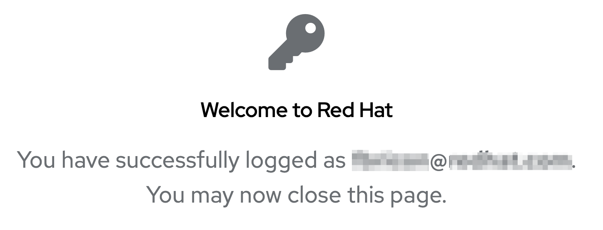
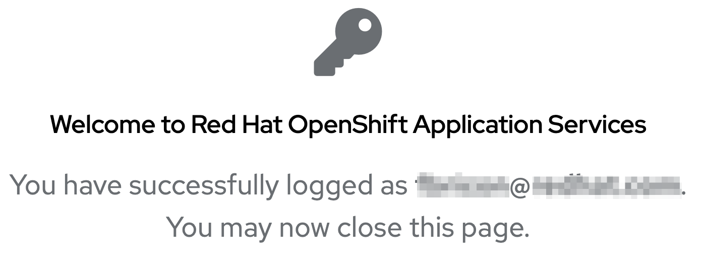
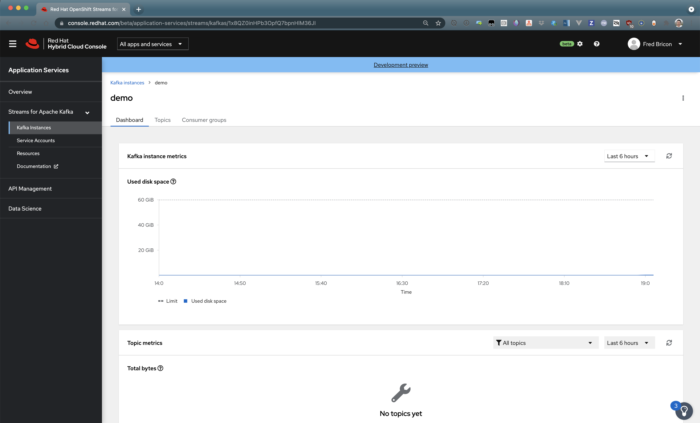

# Red Hat OpenShift Streams For Apache Kafka support

### Installation

You can either:
1. search for and install `Red Hat OpenShift Application Services` directly from the `Extensions` view, it will automatically install its dependencies, [Tools for Apache Kafka](https://github.com/jlandersen/vscode-kafka) and [Red Hat Authentication](https://github.com/redhat-developer/vscode-redhat-account)
2. in the Kafka explorer from `Tools for Apache Kafka`, click on the `Discover Kafka Providers` command, which will automatically perform a search for Kafka providers (see option 1).

### Adding a cluster
Once `Red Hat OpenShift Application Services` is installed, open the Kafka view. Clicking on the `Add new cluster` button (or `+`) in the Kafka Explorer will bring up the options to create new clusters. Select `Red Hat OpenShift Streams For Apache Kafka`:

You will be asked to log into your Red Hat account first:

This will open a browser page to sign into https://sso.redhat.com. Once you signed-in or created an account, your session token will be stored in the IDE, so it can be reused (and refreshed) if necessary.

This first sign-in operation will allow the discovery of your existing `Red Hat OpenShift Streams For Apache Kafka` clusters.

If no clusters have been created yet, a message will provide you with a link to open the [dashboard](https://cloud.redhat.com/beta/application-services/streams/kafkas):

If you already created your Apache Kafka cluster, the extension will require to you to sign into a second SSO, so it can connect to that cluster via SASL/OAUTHBEARER.

That second sign-in is transparent though, you won't need to manually log in.

Finally, your cluster(s) will automatically be added to the Kafka Explorer.

Please read the [`Tools for Apache Kafka` documentation](https://github.com/jlandersen/vscode-kafka/blob/master/docs/README.md) and learn how to manage your Kafka clusters and topics and how to produce or consume messages.

### Opening the Red Hat OpenShift Streams For Apache Kafka dashboard

`Red Hat OpenShift Streams For Apache Kafka` clusters display a unique menu when you right-click on them, to open their online dashboard page:

### About ephemeral clusters

Please be aware ephemeral [`Red Hat OpenShift Streams For Apache Kafka`](https://cloud.redhat.com/beta/application-services/streams/kafkas) clusters are not automatically purged from the Kafka settings after they have been deprovisioned. You will need to [delete](https://github.com/jlandersen/vscode-kafka/blob/master/docs/Explorer.md#delete) them manually from the Kafka Explorer.